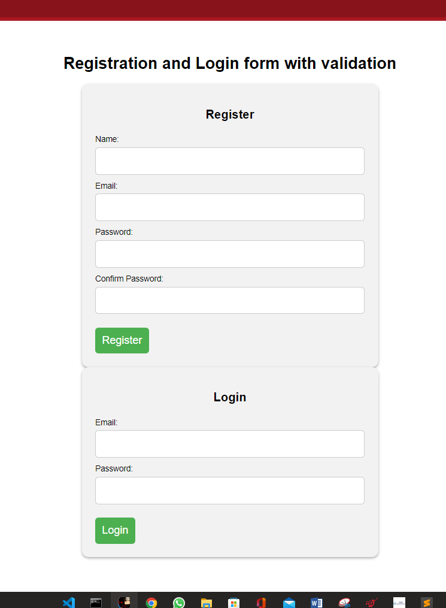

# Assignment 2 - 20BCE10584

## Front-end Html  for Login and Registration Page : -
<br>

```html
<!DOCTYPE html>
<html lang="en">
<head>
  <meta charset="UTF-8">
  <title>Registration and Login form with validation</title>
  <script src="validation.js"></script>
</head>
<style>
    body {
  font-family: Arial, sans-serif;
  margin: 0;
  padding: 0;
}

h1 {
  text-align: center;
  margin-top: 50px;
}

form {
  width: 400px;
  margin: 0 auto;
  background-color: #f2f2f2;
  padding: 20px;
  border-radius: 10px;
  box-shadow: 0px 2px 4px rgba(0, 0, 0, 0.3);
}

form h2 {
  text-align: center;
  margin-bottom: 20px;
}

form div {
  margin-bottom: 10px;
}

form label {
  display: block;
  margin-bottom: 5px;
}

form input[type="text"],
form input[type="email"],
form input[type="password"] {
  width: 100%;
  padding: 10px;
  border-radius: 5px;
  border: 1px solid #ccc;
  box-sizing: border-box;
  font-size: 16px;
}

form button[type="submit"] {
  display: block;
  margin-top: 20px;
  padding: 10px;
  background-color: #4CAF50;
  color: white;
  border: none;
  border-radius: 5px;
  cursor: pointer;
  font-size: 16px;
}

form button[type="submit"]:hover {
  background-color: #3e8e41;
}

span.error {
  color: red;
  font-size: 14px;
}
</style>
<body>
  <h1>Registration and Login form with validation</h1>

  <!-- Registration Form -->
  <form id="register-form" action="register.php" method="post" onsubmit="return validateRegisterForm()">
    <h2>Register</h2>
    <div>
      <label for="name">Name:</label>
      <input type="text" id="name" name="name">
      <span id="name-error"></span>
    </div>
    <div>
      <label for="email">Email:</label>
      <input type="email" id="email" name="email">
      <span id="email-error"></span>
    </div>
    <div>
      <label for="password">Password:</label>
      <input type="password" id="password" name="password">
      <span id="password-error"></span>
    </div>
    <div>
      <label for="confirm-password">Confirm Password:</label>
      <input type="password" id="confirm-password" name="confirm-password">
      <span id="confirm-password-error"></span>
    </div>
    <button type="submit">Register</button>
  </form>

  <!-- Login Form -->
  <form id="login-form" action="login.php" method="post" onsubmit="return validateLoginForm()">
    <h2>Login</h2>
    <div>
      <label for="login-email">Email:</label>
      <input type="email" id="login-email" name="email">
      <span id="login-email-error"></span>
    </div>
    <div>
      <label for="login-password">Password:</label>
      <input type="password" id="login-password" name="password">
      <span id="login-password-error"></span>
    </div>
    <button type="submit">Login</button>
  </form>
</body>
</html>
```
---
<br>

## The __Validation.js__ that is src for \<script> tag : -

<br>

```Javascript
function validateForm() {
  // Get values from form inputs
  const username = document.getElementById("username").value;
  const email = document.getElementById("email").value;
  const password = document.getElementById("password").value;
  const confirmPassword = document.getElementById("confirm_password").value;

  // Define regex patterns for validation
  const usernameRegex = /^[a-zA-Z0-9]{6,}$/;
  const emailRegex = /^[^\s@]+@[^\s@]+\.[^\s@]+$/;
  const passwordRegex = /^(?=.*\d)(?=.*[a-z])(?=.*[A-Z])[0-9a-zA-Z]{8,}$/;

  // Define error messages
  let errorMessage = "";
  let isError = false;

  // Validate username
  if (!usernameRegex.test(username)) {
    errorMessage += "Username must contain at least 6 alphanumeric characters.\n";
    isError = true;
  }

  // Validate email
  if (!emailRegex.test(email)) {
    errorMessage += "Invalid email address.\n";
    isError = true;
  }

  // Validate password
  if (!passwordRegex.test(password)) {
    errorMessage += "Password must contain at least 8 characters, including 1 uppercase letter, 1 lowercase letter, and 1 number.\n";
    isError = true;
  }

  // Validate confirm password
  if (password !== confirmPassword) {
    errorMessage += "Passwords do not match.\n";
    isError = true;
  }

  // If there are errors, display them and prevent form submission
  if (isError) {
    alert(errorMessage);
    return false;
  }

  // If there are no errors, allow form submission
  return true;
}
```
---

## **Registration.php : -**

<br>

```php
<?php
// Connect to MySQL
$conn = mysqli_connect('localhost', 'username', 'password', 'database_name');

// Check connection
if (!$conn) {
  die("Connection failed: " . mysqli_connect_error());
}

// Check if form is submitted
if (isset($_POST['submit'])) {
  // Get input values from form
  $username = mysqli_real_escape_string($conn, $_POST['username']);
  $email = mysqli_real_escape_string($conn, $_POST['email']);
  $password = mysqli_real_escape_string($conn, $_POST['password']);

  // Check if username already exists
  $sql = "SELECT * FROM users WHERE username='$username'";
  $result = mysqli_query($conn, $sql);
  if (mysqli_num_rows($result) > 0) {
    echo "Username already taken";
  } else {
    // Hash password
    $hash = password_hash($password, PASSWORD_DEFAULT);

    // Insert user data into database
    $sql = "INSERT INTO users (username, email, password) VALUES ('$username', '$email', '$hash')";
    if (mysqli_query($conn, $sql)) {
      echo "Registration successful";
    } else {
      echo "Error: " . $sql . "<br>" . mysqli_error($conn);
    }
  }

  // Close connection
  mysqli_close($conn);
}
?>
```
## **Login.php : -**

```php
<?php
// Start session
session_start();

// Connect to MySQL
$conn = mysqli_connect('localhost', 'username', 'password', 'database_name');

// Check connection
if (!$conn) {
  die("Connection failed: " . mysqli_connect_error());
}

// Check if form is submitted
if (isset($_POST['submit'])) {
  // Get input values from form
  $username = mysqli_real_escape_string($conn, $_POST['username']);
  $password = mysqli_real_escape_string($conn, $_POST['password']);

  // Check if username exists
  $sql = "SELECT * FROM users WHERE username='$username'";
  $result = mysqli_query($conn, $sql);
  if (mysqli_num_rows($result) > 0) {
    // Get password hash from database
    $row = mysqli_fetch_assoc($result);
    $hash = $row['password'];

    // Verify password
    if (password_verify($password, $hash)) {
      // Password matches, set session variable
      $_SESSION['username'] = $username;
      echo "Login successful";
    } else {
      echo "Incorrect password";
    }
  } else {
    echo "Username does not exist";
  }

  // Close connection
  mysqli_close($conn);
}
?>
```

# **Output** : -


