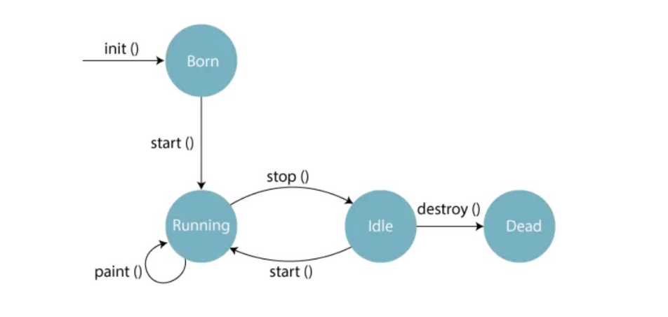
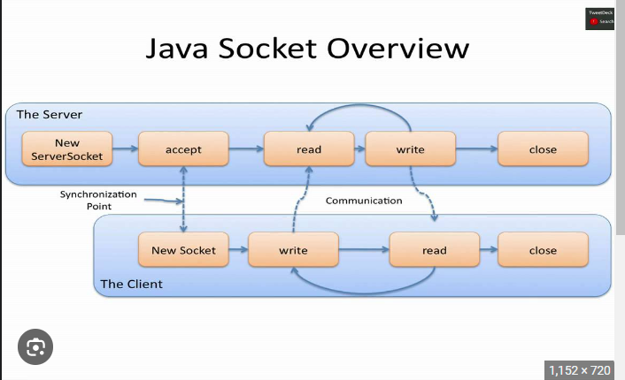
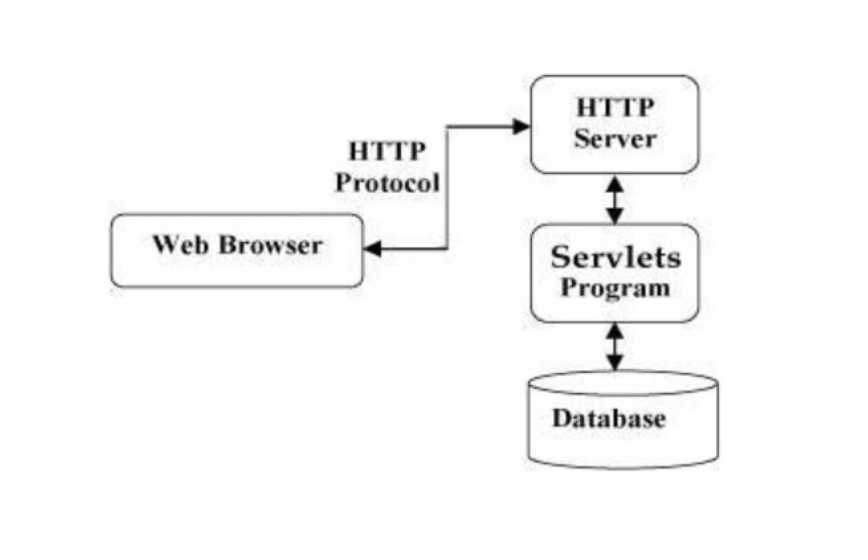

```
java term end
```

UNIT 4

Q1) Summarize  the  need  for  swing  class,  class  hierarchy  and  its  features  with  example.  Compare  AWT  and swing. 

Ans)

The Swing library in Java serves as a powerful and flexible GUI (Graphical User Interface) toolkit, providing developers with a wide range of components, layouts, and features to create interactive and visually appealing applications.

Here's an overview of the need for Swing class hierarchy, its features, and a comparison with AWT:

**Need for Swing Class Hierarchy:**

AWT Limitations:
The AWT (Abstract Window Toolkit) provided a basic set of GUI components, but it had certain limitations in terms of customization, platform independence, and extensibility.

Enhanced Functionality:
Swing was developed to overcome these limitations and offer a more feature-rich and customizable GUI framework for Java applications.

Modern Look and Feel:
 Swing allows developers to create applications with a consistent and modern look across different platforms, thanks to its pluggable look and feel architecture.

Lightweight Components:
 Swing components are lightweight, meaning they are rendered in Java code rather than relying on native platform components, resulting in greater portability and consistent behavior.

**Swing Class Hierarchy and Features:**

Extensive Component Set:
Swing provides a wide range of components beyond AWT, including buttons, checkboxes, radio buttons, labels, text fields, text areas, tables, trees, menus, and more.

Layout Managers:
Swing offers various layout managers that allow precise positioning and arrangement of components within containers, ensuring flexibility across different screen sizes and resolutions.

Customization Options:
 Swing components are highly customizable, allowing developers to apply custom painting, create custom renderers, and modify visual aspects such as colors, fonts, and borders.

Event-Driven Programming:
 Swing follows an event-driven programming model, where user interactions or actions trigger events that can be handled by listeners, enabling the creation of interactive and responsive applications.

Pluggable Look and Feel:
 Swing's look and feel architecture allows developers to switch between different visual styles, such as the default Metal look and feel, Windows look and feel, or third-party look and feel implementations.

**Comparison with AWT:**

**Platform Independence:** 

Swing components are implemented entirely in Java, providing consistent behavior and appearance across different platforms. AWT components, on the other hand, rely on the underlying platform's native components, potentially resulting in platform-specific variations.

Customizability:
 Swing offers greater customization options, including custom painting, look and feel customization, and component styling. AWT has limited customization capabilities.

Feature Set:
 Swing provides a more extensive and advanced set of components compared to AWT. Swing includes additional components, layout managers, and features like double buffering, accessibility support, and improved event handling.

Performance:
 Due to its lightweight nature, Swing components generally offer better performance and responsiveness compared to AWT, especially in complex GUI scenarios.

In summary, Swing emerged as an improved alternative to AWT, addressing its limitations and providing a more versatile and feature-rich GUI framework. Swing's class hierarchy offers extensive components, layout managers, customization options, and event-driven programming, empowering developers to create modern and interactive Java applications.

<br>

>Unit 5

Q1) Describe the Life cycle of an Applet with diagram in details and its Hierarchy of Applet class. Write an applet program to display sum of two numbers with output.

Ans) 



<br>

The life cycle of an applet refers to the series of methods that are invoked by the Java Virtual Machine (JVM) during the various stages of an applet's execution. The life cycle of an applet can be divided into four main stages: initialization, start, paint/update, and stop/destroy.


Here's a detailed description of the applet life cycle stages with a diagram:

Initialization:

init(): This method is called when the applet is first loaded into memory. It is used to initialize the applet, set up the initial state, and perform any one-time initialization tasks.

start(): This method is called after the init() method and is used to start the applet's execution. It is invoked whenever the applet needs to be started or restarted.

Start:

start(): This method is called when the applet needs to start or resume its execution after being paused or stopped.

paint(): This method is called after the start() method and is responsible for rendering the visual representation of the applet. It is automatically invoked whenever the applet needs to be repainted, such as when it is first displayed, resized, or covered and then revealed.

Paint/Update:

paint(): This method is responsible for rendering the visual output of the applet and is automatically called whenever a repaint is needed.

update(): This method is called after the paint() method and is responsible for preparing the applet's graphics context for rendering. It is usually overridden to provide custom update behavior if necessary.

Stop/Destroy:

stop(): This method is called when the applet needs to be temporarily stopped or paused, such as when the applet window is minimized or covered by another window.

destroy(): This method is called when the applet is about to be permanently stopped or destroyed. It is used to release any resources held by the applet and perform necessary cleanup tasks.

<br>

hierarchy of applet class.

```
java.lang.Object
  └─ java.awt.Component
       └─ java.awt.Container
            └─ java.applet.Applet
```
<br>
Example code: 

```java
import java.applet.Applet;
import java.awt.Graphics;

public class SumApplet extends Applet {
    public void paint(Graphics g) {
        int num1 = 5;
        int num2 = 3;
        int sum = num1 + num2;
        
        g.drawString("The sum of " + num1 + " and " + num2 + " is: " + sum, 50, 50);
    }
}
```

Advantage and Disadvantages of applet :

Advantages :

1) It takes very less response time as it works on the client side.
2) It can be run on any browser which has JVM running in it.
3) They increase interactivity for users.
4) As  compared  to  stand-alone  application  applets  are  small  in  size,  theadvantage of transferring it over network makes it more usable.
5) Applets cache quickly, that’s why there will be no latency in downloading of them.

Disadvantages :

1) If a proxy server is applied to web access, than automatically installationand update of Java can be failed.
2) Applets  don’t  access  client-side  resources,  like-Files,  Operating  systemetc.
3) Applets  have  to  tag  as  trusted  applets  and  they  must  be  registered  toAPS (Applet Security Manager).
4) Some  browsers  especially  mobile  browsers  which  are  running  on  AppleIOS or Android don’t support applets run.
5) Applet cannot work with native methods.

---


Q3) Describe the Java Socket Programming process with neat diagram. Write a Socket Programming for Read-Write message from client and server with output.

Ans )



Java Socket Programming is a mechanism that allows communication between client and server applications over a network using sockets. Sockets provide a low-level interface for network communication, enabling data exchange between applications running on different machines. Here's a description of the Java Socket Programming process with a diagram:

**Server Setup:**

The server creates a ServerSocket object and binds it to a specific port number.
The server waits for client connections on the specified port.

**Client Connection:**

The client creates a Socket object and specifies the server's IP address and port number.
The client initiates a connection request to the server.

**Server Acceptance:**

The server's ServerSocket listens for incoming client connections.
When a client connection request is received, the server's ServerSocket accepts the connection and creates a new Socket object to represent the client.

**Client-Server Communication:**

Once the client-server connection is established, they can exchange data using input and output streams associated with the client and server sockets.
The client and server can read from and write to the input and output streams to send and receive data.

**Data Transmission:**

The client and server can exchange messages or any other form of data using the input and output streams.
The data can be sent as bytes, strings, or any other appropriate format, depending on the application's requirements.

**Termination:**

Either the client or server can terminate the connection by closing the sockets.
Upon termination, the resources associated with the sockets are released, and the communication ends.

**Client Code :**

```java
import java.io.*;
import java.net.*;

public class clientSide{

    //initialize socket and input,output stream
    private Socket socket = null;
    private DataInputStream input = null;
    private DataOutputStream output = null;

    //constructor to put ip and port
    public cliendSide(String address, int port){

        //establish connection
        try{
            socket = new Socket(port);
            System.out.println("Connected");
            
            input = new DataInputStream(System.in);//input object

            output = new DataOutputStream(socket.getOutputStream());
            //for sending output to the socket.   
        }
        catch(UnknownHostException u){
            System.out.println(u);
        }
        catch(IOException e){
            System.out.println(e);
        }

        String line = "";

        //keep reading until END is entered
        while(!line.equals("END")){
            try{
                line = input.readLine();

                output.writeUTF(line);
            }
            catch(IOException e){
                System.out.println(e);
            }
        }
        try{
            input.close();
            output.close();
            socket.close();
        }
        catch{
            System.out.println("error");
        }
    }//constructor ends here
    
    public static void main(String [] args){
        clientSide client = new clientSide('127.0.0.1',1234);
    }
}
```
<br>

**Server Code :**

```java
import java.io.*;
import java.net.*;

public class serverSide{

    //initialize socket and input,output stream
    private ServerSocket socket = null;
    private DataInputStream input = null;
    private DataOutputStream output = null;

    //constructor to put ip and port
    public serverSide(int port){

        //start server and wait for connection
        try{
            server = new ServerSocket(port);
            System.out.println("Server Started");
            System.out.println("Waiting for client");

            socket = server.accept();
            System.out.println("Client's request accepted");
            
            input = new DataInputStream(new BufferedInputStream(socket.getInputStream()));
            //here input is output of client

            output = new DataOutputStream(socket.getOutputStream());
            //for sending reply to the client.  
        }
        catch(UnknownHostException u){
            System.out.println(u);
        }
        catch(IOException e){
            System.out.println(e);
        }

        String line = "";

        //keep reading until client sends END in text
        while(!line.equals("END")){
            try{
                line = input.readUTF();

                System.out.println(line);
            }
            catch(IOException e){
                System.out.println(e);
            }
        }

        output.writeUTF("Server: Hello Client, Message Received!");

        try{
            input.close();
            output.close();
            socket.close();
        }
        catch{
            System.out.println("error");
        }
    
    }//constructor ends here
        

    public static void main(String [] args){
        serverSide server = new serverSide(1234);
    }
}
```
---
---

Q5)Identify the need for servlet and CGI. Write the Classes and Interfaces in javax.servlet package. Describe 
the steps to create a servlet with suitable example.

Ans ) 

Servlets and CGI (Common Gateway Interface) are both technologies used for developing dynamic web applications, but they serve different purposes. Here's a brief overview of their needs and use cases:



**Servlet:**

Servlets are Java-based server-side components that are used to extend the functionality of a web server.
They are designed to handle HTTP requests and generate dynamic web content.

Servlets are platform-independent and provide a powerful API for building web applications.

The main needs for using servlets include:

<u>Dynamic Content Generation:</u> Servlets allow the generation of dynamic content based on user requests. They can process form data, query databases, perform business logic, and generate dynamic HTML, XML, or other types of responses.

<u>Session Management:</u> Servlets support session management, allowing the tracking of user interactions across multiple requests.

<u>Scalability and Performance:</u> Servlets can handle multiple requests concurrently, making them suitable for high-traffic applications.

<u>Security:</u> Servlets provide built-in security features and can be integrated with authentication and authorization mechanisms.

**CGI (Common Gateway Interface):**

CGI is a standard protocol that allows web servers to communicate with external programs or scripts.

CGI programs are executed by the web server to process specific requests and generate dynamic content.

The main needs for using CGI include:

<u>Compatibility with Different Languages:</u> CGI supports multiple programming languages, including Perl, Python, C/C++, and more. It allows developers to use their preferred programming language to generate dynamic web content.

<u>Simplicity and Flexibility:</u> CGI is relatively easy to implement, as it involves writing standalone programs that can be executed by the web server. It provides flexibility in choosing the programming language and tools.

<u>Independence from Web Server Technology:</u> CGI programs can run on any web server that supports the CGI protocol, making them compatible with various web server technologies.

In summary, servlets are a Java-based technology used for building dynamic web applications with advanced features like session management, scalability, and security. CGI, on the other hand, is a protocol that allows external programs or scripts to generate dynamic web content using different programming languages. The choice between servlets and CGI depends on the specific requirements and preferences of the web application being developed.

The javax.servlet package in Java provides classes and interfaces that are used for developing servlet-based web applications. Here are some of the important classes and interfaces in the javax.servlet package:

**Classes:**

GenericServlet: An abstract class that provides a generic implementation of the Servlet interface. Servlets typically extend this class to implement their specific functionality.

HttpServlet: An abstract class that extends GenericServlet and provides specific methods for handling HTTP requests and generating HTTP responses. Servlets that handle HTTP-based applications extend this class.

ServletContext: An interface that represents a web application's servlet context. It provides methods to interact with the web application's environment, such as obtaining initialization parameters, accessing resources, and managing attributes.

ServletRequest: An interface that represents a client's request to the server. It provides methods to access request parameters, headers, and other information sent by the client.

ServletResponse: An interface that represents the server's response to a client's request. It provides methods to set response headers, write response content, and manage response-specific information.

**Interfaces:**

Servlet: The main interface that all servlets must implement. It defines methods for the servlet's initialization, handling requests, and destroying the servlet.

Filter: An interface that defines a filter, which can intercept and modify requests and responses between the client and servlets. Filters are used to implement common functionality, such as authentication, logging, or compression.

ServletConfig: An interface that provides configuration information to a servlet. It allows the servlet to access its initialization parameters and the servlet context.

ServletRequestListener: An interface that defines callback methods for handling events related to ServletRequest objects. It allows developers to perform custom operations when requests are created or destroyed.

ServletResponseListener: An interface that defines callback methods for handling events related to ServletResponse objects. It allows developers to perform custom operations when responses are created or sent.

---
---

Q8) Demonstrate the working of Message-Driven Bean and its steps with neat sketch. Write the methods used 
in javax.ejb.MessageDriverBean interface. Compare Session and Entity Bean.

ans) 
Message-Driven Bean (MDB) Working:

A Message-Driven Bean (MDB) is a type of Enterprise JavaBean (EJB) that allows asynchronous processing of messages.

MDBs are designed to receive messages from a messaging system and perform business logic based on those messages.

**The working of an MDB involves the following steps:**

A message is sent to a message destination, such as a message queue or a topic, by a producer.

The messaging system receives the message and delivers it to the MDB.
The MDB, implemented as a message-driven class, processes the message asynchronously.

The result or response, if any, can be sent back to another destination or communicated through other means.

Methods in javax.ejb.MessageDrivenBean interface:

**The javax.ejb.MessageDrivenBean interface defines the following methods**:

setMessageDrivenContext(MessageDrivenContext ctx): Sets the context for the message-driven bean instance.

ejbCreate(): Invoked when a message-driven bean instance is created.
onMessage(Message message): Handles the incoming message and performs the business logic.

ejbRemove(): Invoked when a message-driven bean instance is about to be removed.

ejbActivate(): Invoked when a message-driven bean instance is activated.

ejbPassivate(): Invoked when a message-driven bean instance is passivated.

**Comparison of Session Bean and Entity Bean:**

Session Bean: Session beans represent the business logic of an application. They are used to encapsulate and provide services to clients. Session beans can be stateful or stateless and are used to implement business processes or workflows.

Entity Bean: Entity beans represent persistent data stored in a database. They are used to model and manage entities, such as records or objects in a database. Entity beans provide database access and persistence features, allowing manipulation of data.

Comparison:

Purpose: Session beans are used for implementing business logic, while entity beans are used for persistence and data management.

State: Session beans can be stateful or stateless, while entity beans represent persistent data and have a state associated with the data.

Lifecycle: Session beans have a well-defined lifecycle, including creation, activation, passivation, and removal. Entity beans have their lifecycle managed by the EJB container.

Relationship: Session beans can interact with other beans and services, while entity beans represent data and may have relationships with other entities.

---
---

Q9) Demonstrate with example for EJB Transactions and EJB Security in details. 

Ans) 

**EJB Transactions:**

EJB transactions ensure the consistency and integrity of data operations within an application. Consider a banking application where funds need to be transferred between two accounts. With EJB transactions, the transfer can be done atomically, ensuring that both the deduction from one account and the addition to the other account occur together. If any step fails, the entire transaction is rolled back, and the data remains consistent.

Imagine a scenario where an exception occurs while transferring funds. Without EJB transactions, it might lead to an inconsistent state where money is deducted from one account but not added to the other. EJB transactions prevent this by providing an all-or-nothing approach, where either the entire transaction succeeds, or it is rolled back, maintaining data integrity.

**EJB Security:**

EJB security provides mechanisms to control access to application components based on user roles and permissions. Let's consider an employee management application. Different users have different roles and levels of access within the application.

With EJB security, you can define roles such as "admin," "manager," and "employee." Based on these roles, you can restrict access to certain operations. For example, only users with the "admin" or "manager" role may have permission to delete an employee record. Users with the "employee" role may only have read access to employee records.

EJB security ensures that unauthorized users cannot perform restricted operations. It helps maintain data privacy, prevent unauthorized modifications, and control access to sensitive functionalities within the application.

By configuring security settings and defining roles and permissions, EJB security allows you to enforce access control policies and protect the application's resources.

These examples illustrate the concepts of EJB transactions and EJB security without delving into specific code implementations. EJB transactions provide consistency and data integrity by ensuring that multiple operations are treated as a single atomic unit. EJB security, on the other hand, allows you to control access to application components based on user roles and permissions, safeguarding data and functionalities.


---
---

```
UNIT 4 
```
Q3) Implement the following Layout Management for any specific applications like Hospital management, 
Library management and Ticket reservation system. 

i. BorderLayout, ii. GridLayout, iii. GridBagLayout

Ans) 

BorderLayout
```java
import javax.swing.*;
import java.awt.*;

public class TicketReservationSystem {
    public static void main(String[] args) {
        JFrame frame = new JFrame("Ticket Reservation System");
        frame.setDefaultCloseOperation(JFrame.EXIT_ON_CLOSE);
        frame.setSize(800, 600);
        frame.setLayout(new BorderLayout());

        // North Panel
        JPanel northPanel = new JPanel();
        northPanel.add(new JLabel("Header"));
        frame.add(northPanel, BorderLayout.NORTH);

        // Center Panel
        JPanel centerPanel = new JPanel();
        centerPanel.setLayout(new GridLayout(4, 3));
        for (int i = 1; i <= 12; i++) {
            JButton button = new JButton("Seat " + i);
            centerPanel.add(button);
        }
        frame.add(centerPanel, BorderLayout.CENTER);

        // South Panel
        JPanel southPanel = new JPanel();
        southPanel.add(new JLabel("Footer"));
        frame.add(southPanel, BorderLayout.SOUTH);

        frame.setVisible(true);
    }
}
```
GridLayout
```java
import javax.swing.*;
import java.awt.*;

public class TicketReservationSystem {
    public static void main(String[] args) {
        JFrame frame = new JFrame("Ticket Reservation System");
        frame.setDefaultCloseOperation(JFrame.EXIT_ON_CLOSE);
        frame.setSize(800, 600);
        frame.setLayout(new GridLayout(3, 3));

        for (int i = 1; i <= 9; i++) {
            JButton button = new JButton("Seat " + i);
            frame.add(button);
        }

        frame.setVisible(true);
    }
}

```
GridBagLayout
```java
import javax.swing.*;
import java.awt.*;

public class TicketReservationSystem {
    public static void main(String[] args) {
        JFrame frame = new JFrame("Ticket Reservation System");
        frame.setDefaultCloseOperation(JFrame.EXIT_ON_CLOSE);
        frame.setSize(800, 600);
        frame.setLayout(new GridBagLayout());

        GridBagConstraints constraints = new GridBagConstraints();
        constraints.fill = GridBagConstraints.HORIZONTAL;

        for (int i = 1; i <= 12; i++) {
            JButton button = new JButton("Seat " + i);
            constraints.gridx = (i - 1) % 4;
            constraints.gridy = (i - 1) / 4;
            frame.add(button, constraints);
        }

        frame.setVisible(true);
    }
}

```
---
---

Q4) Create a student course registration form using swing Text Input fields ActionListener like Text Fields, 
Password Fields, Text Areas, Scroll Pane and Labeling Components with sample output.

Ans) 

```java
import javax.swing.*;
import java.awt.*;
import java.awt.event.ActionEvent;
import java.awt.event.ActionListener;

public class StudentRegistrationForm extends JFrame implements ActionListener {
    private JTextField nameField;
    private JPasswordField passwordField;
    private JTextArea addressArea;
    private JScrollPane addressScrollPane;
    private JLabel nameLabel;
    private JLabel passwordLabel;
    private JLabel addressLabel;
    private JButton submitButton;

    public StudentRegistrationForm() {
        setTitle("Student Course Registration Form");
        setSize(400, 300);
        setDefaultCloseOperation(JFrame.EXIT_ON_CLOSE);
        setLayout(new GridLayout(4, 2));

        nameLabel = new JLabel("Name:");
        nameField = new JTextField();

        passwordLabel = new JLabel("Password:");
        passwordField = new JPasswordField();

        addressLabel = new JLabel("Address:");
        addressArea = new JTextArea();
        addressScrollPane = new JScrollPane(addressArea);

        submitButton = new JButton("Submit");
        submitButton.addActionListener(this);

        add(nameLabel);
        add(nameField);
        add(passwordLabel);
        add(passwordField);
        add(addressLabel);
        add(addressScrollPane);
        add(new JLabel()); // Placeholder for empty cell
        add(submitButton);

        setVisible(true);
    }

    public void actionPerformed(ActionEvent e) {
        if (e.getSource() == submitButton) {
            String name = nameField.getText();
            String password = new String(passwordField.getPassword());
            String address = addressArea.getText();

            // Perform further processing with the entered data
            // Example: Saving the information to a database

            JOptionPane.showMessageDialog(this, "Registration Successful!",
                    "Success", JOptionPane.INFORMATION_MESSAGE);
        }
    }

    public static void main(String[] args) {
        SwingUtilities.invokeLater(() -> new StudentRegistrationForm());
    }
}

```
---
---

Q6) 

Ans) 

```java
import javax.swing.*;
import java.awt.*;
import java.awt.event.ActionEvent;
import java.awt.event.ActionListener;
import java.awt.event.KeyEvent;

public class NotepadApplication extends JFrame implements ActionListener {
    private JTextArea textArea;

    public NotepadApplication() {
        setTitle("Notepad");
        setSize(800, 600);
        setDefaultCloseOperation(JFrame.EXIT_ON_CLOSE);

        textArea = new JTextArea();
        JScrollPane scrollPane = new JScrollPane(textArea);
        add(scrollPane);

        createMenuBar();

        setVisible(true);
    }

    private void createMenuBar() {
        JMenuBar menuBar = new JMenuBar();

        JMenu fileMenu = new JMenu("File");
        fileMenu.setMnemonic(KeyEvent.VK_F);

        JMenuItem openMenuItem = new JMenuItem("Open");
        openMenuItem.setIcon(new ImageIcon("open.png"));
        openMenuItem.setMnemonic(KeyEvent.VK_O);
        openMenuItem.addActionListener(this);
        fileMenu.add(openMenuItem);

        JMenuItem saveMenuItem = new JMenuItem("Save");
        saveMenuItem.setIcon(new ImageIcon("save.png"));
        saveMenuItem.setMnemonic(KeyEvent.VK_S);
        saveMenuItem.addActionListener(this);
        fileMenu.add(saveMenuItem);

        fileMenu.addSeparator();

        JMenuItem exitMenuItem = new JMenuItem("Exit");
        exitMenuItem.setMnemonic(KeyEvent.VK_X);
        exitMenuItem.addActionListener(this);
        fileMenu.add(exitMenuItem);

        menuBar.add(fileMenu);

        setJMenuBar(menuBar);

        JToolBar toolBar = new JToolBar();
        toolBar.add(new JButton(new ImageIcon("open.png")));
        toolBar.add(new JButton(new ImageIcon("save.png")));
        add(toolBar, BorderLayout.NORTH);

        JPopupMenu popupMenu = new JPopupMenu();
        JMenuItem cutMenuItem = new JMenuItem("Cut");
        JMenuItem copyMenuItem = new JMenuItem("Copy");
        JMenuItem pasteMenuItem = new JMenuItem("Paste");
        popupMenu.add(cutMenuItem);
        popupMenu.add(copyMenuItem);
        popupMenu.add(pasteMenuItem);
        textArea.setComponentPopupMenu(popupMenu);

        ToolTipManager.sharedInstance().setInitialDelay(1000);
        openMenuItem.setToolTipText("Open a file");
        saveMenuItem.setToolTipText("Save the file");
        cutMenuItem.setToolTipText("Cut selected text");
        copyMenuItem.setToolTipText("Copy selected text");
        pasteMenuItem.setToolTipText("Paste from clipboard");
    }

    public void actionPerformed(ActionEvent e) {
        if (e.getActionCommand().equals("Open")) {
            // Handle open action
        } else if (e.getActionCommand().equals("Save")) {
            // Handle save action
        } else if (e.getActionCommand().equals("Exit")) {
            System.exit(0);
        }
    }

    public static void main(String[] args) {
        SwingUtilities.invokeLater(() -> new NotepadApplication());
    }
}
```
---
---

Q9) Implement an organization management system using Swing Components ActionListener like List, Trees, 
Tables and Progress Bars with sample output. 

Ans) 

```java
import javax.swing.*;
import java.awt.*;

public class OrganizationManagementSystem extends JFrame {
    public OrganizationManagementSystem() {
        setTitle("Organization Management System");
        setSize(800, 600);
        setDefaultCloseOperation(JFrame.EXIT_ON_CLOSE);
        setLayout(new BorderLayout());

        createEmployeeList();
        createDepartmentTree();
        createEmployeeTable();
        createProgressBar();

        setVisible(true);
    }

    private void createEmployeeList() {
        DefaultListModel<String> employeeListModel = new DefaultListModel<>();
        employeeListModel.addElement("John Doe");
        employeeListModel.addElement("Jane Smith");
        employeeListModel.addElement("Mark Johnson");

        JList<String> employeeList = new JList<>(employeeListModel);
        add(new JScrollPane(employeeList), BorderLayout.WEST);
    }

    private void createDepartmentTree() {
        DefaultMutableTreeNode root = new DefaultMutableTreeNode("Departments");

        DefaultMutableTreeNode salesNode = new DefaultMutableTreeNode("Sales");
        salesNode.add(new DefaultMutableTreeNode("John Doe"));
        salesNode.add(new DefaultMutableTreeNode("Jane Smith"));

        DefaultMutableTreeNode engineeringNode = new DefaultMutableTreeNode("Engineering");
        engineeringNode.add(new DefaultMutableTreeNode("Mark Johnson"));

        root.add(salesNode);
        root.add(engineeringNode);

        JTree departmentTree = new JTree(root);
        add(new JScrollPane(departmentTree), BorderLayout.CENTER);
    }

    private void createEmployeeTable() {
        String[] columnNames = {"Name", "Department"};

        Object[][] data = {
                {"John Doe", "Sales"},
                {"Jane Smith", "Sales"},
                {"Mark Johnson", "Engineering"}
        };

        JTable employeeTable = new JTable(data, columnNames);
        add(new JScrollPane(employeeTable), BorderLayout.EAST);
    }

    private void createProgressBar() {
        JProgressBar progressBar = new JProgressBar();
        progressBar.setStringPainted(true);
        progressBar.setValue(75);
        add(progressBar, BorderLayout.SOUTH);
    }

    public static void main(String[] args) {
        SwingUtilities.invokeLater(() -> new OrganizationManagementSystem());
    }
}
```
---
---

```
Unit 3
```
Q9) 

Ans)

Coding transactions in a database is essential to ensure data integrity and consistency. Transactions provide a way to group multiple database operations into a single logical unit, ensuring that either all operations succeed or none of them take effect.

The need for coding transactions in a database can be summarized as follows:

Atomicity: Transactions ensure that a group of database operations is treated as a single indivisible unit. If any part of the transaction fails, all changes made within the transaction are rolled back, and the database remains unchanged.

Consistency: Transactions help maintain the integrity and consistency of the database. By grouping related operations together, transactions ensure that the database transitions from one valid state to another, adhering to defined rules and constraints.

Isolation: Transactions provide isolation between concurrent database operations. Concurrent access to the database can lead to data inconsistencies and conflicts. Transactions ensure that each operation is executed in isolation from others, preventing interference and maintaining data integrity.

Durability: Once a transaction is committed, its changes are permanent and survive any subsequent failures or system restarts. This ensures the durability and reliability of the database.

**Important functions in transaction management include:**

Begin Transaction: This function marks the beginning of a transaction. It sets the context for a group of database operations that will be treated as a single unit.

Commit: The commit function is used to finalize a transaction and make its changes permanent in the database. Once committed, the changes are durable and cannot be rolled back.

Rollback: Rollback is used to cancel or undo the changes made within a transaction. If any part of the transaction fails or encounters an error, the rollback function is called to revert all changes made within the transaction.

Savepoint: Savepoints allow for nested transactions or the ability to create intermediate points within a transaction. If a failure occurs, the transaction can be rolled back to a specific savepoint rather than the beginning.

Concurrency Control: Transaction management includes mechanisms for concurrency control to handle multiple concurrent transactions. This involves managing locks, isolation levels, and ensuring data consistency during concurrent access.

Error Handling: Transaction management provides error handling mechanisms to handle exceptions and errors that may occur during the execution of a transaction. This includes handling database errors, network failures, and application-specific exceptions.

By utilizing these functions and practices, transaction management ensures the reliability, consistency, and integrity of data within a database system.

---
---

